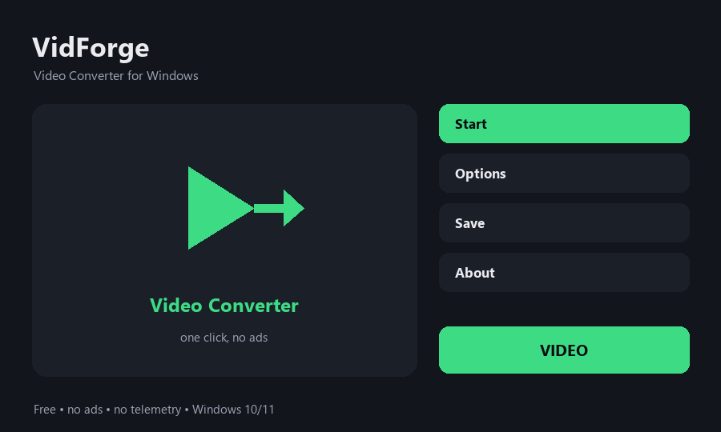

# VidForge — Video Converter for Windows

Free video converter for Windows - MP4, MKV, AVI, MOV, WEBM, GIF, MP3

**[⬇ Download for Windows](../../releases/latest)** — free, no ads, no account, no sign-up. One small file, unzip and run.

## What it does

- Convert to MP4, MKV, AVI, MOV or WEBM
- Make an animated GIF from any clip
- Extract the audio track to MP3
- ffmpeg is built in - nothing else to install
- The window stays responsive while it converts
- Free and open source, no ads and no telemetry

## How to use

1. Open VidForge and press Browse to pick a video.
2. Choose the target format: MP4, MKV, AVI, MOV, WEBM, GIF or MP3.
3. Press Convert - the window stays usable while it works.
4. The converted file appears next to the original.

## Requirements

Windows 10 or 11, 64-bit. No admin rights needed and nothing is written to the registry. ffmpeg is built in, so there is nothing else to install.

## Privacy

Everything happens on your PC. Nothing is uploaded, no telemetry, no ads.

## Licence

MIT — free to use, free to share.
