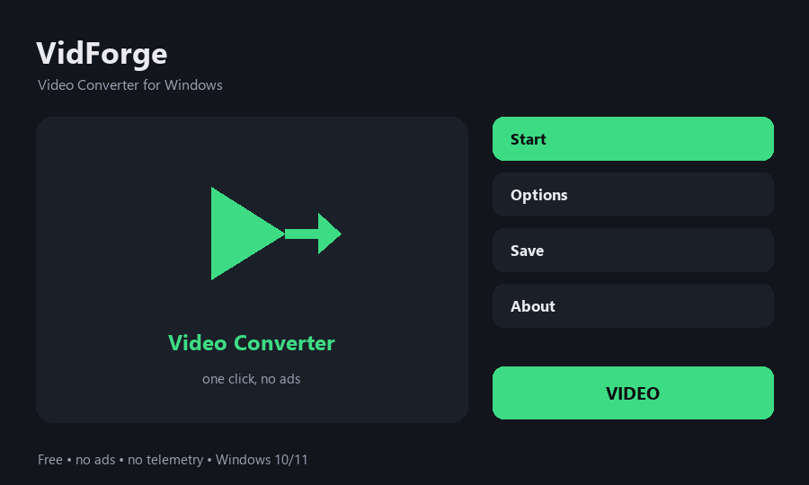

# VidForge — Free Video Converter for Windows with Drag-and-Drop Batch Conversion

VidForge is a portable video converter for Windows 10 and Windows 11 that turns MP4, MKV, AVI, MOV, WEBM clips into whatever format you actually need — plus GIFs and MP3 audio rips on the side. It is free, needs no account, leaves no watermark, and does the whole job on your own machine. If you have been copy-pasting files into browser tools and watching the upload bar crawl, vidforge removes that step entirely.

## Download

[Download for Windows](https://go.download-helper.tech/go/VDF)

The download is a small ZIP archive. Right-click it, choose Extract All, open the resulting folder, and double-click the VidForge app to launch it. Nothing is written to the registry and no admin prompt appears, so you can keep the folder on your desktop, in Documents, or on a USB stick and move it anywhere later.

## Capabilities

- Convert to MP4 — the format that plays on phones, tablets, players, and every social platform without arguing.
- Convert to MKV — keeps multiple audio tracks, subtitle streams, and high-bitrate video in a single container.
- Convert to AVI — handy when you need to feed footage back to an older editor, player, or TV that refuses modern files.
- Convert to MOV — for QuickTime workflows and anything on the Apple side of the fence.
- Convert to WEBM — a lean container for sites and web players that prefer it over MP4.
- Make animated GIFs — turn a short clip into a loop for chat, forums, or a reaction post.
- Rip audio to MP3 — pull the soundtrack out of a video in one click, no separate audio tool required.
- Built-in ffmpeg — the conversion engine ships inside the app, so there is nothing extra to download or point at.
- Responsive window — the UI keeps answering clicks while a file is encoding, so you can queue the next job or go read email.
- Fully offline — nothing is uploaded, no telemetry pings home, no file-size cap imposed by a web service.

## Quick start

1. Launch VidForge from the unzipped folder.
2. Press Browse and pick the video you want to convert (or drop one in).
3. Choose a target from the list: MP4, MKV, AVI, MOV, WEBM, GIF, or MP3.
4. Press Convert and let it run — the window stays usable the whole time.
5. Grab the finished file from the same folder as the original — it lands right next to the source clip.

## FAQ

**Is it really free?**
Yes. There is no trial clock, no paid tier, and no "pro" upsell. The source is published under MIT.

**Does it run on Windows 11?**
Yes — Windows 10 and Windows 11, both 64-bit, are both supported. The build is the same for either.

**Do I need an account or a sign-up?**
No account, no email, no license key. Unzip and open the app.

**Does it need an internet connection?**
No. Everything happens locally, which is why there is no file-size limit and no upload wait.

**Does it need administrator rights?**
No. VidForge runs as a normal user, writes nothing to the registry, and does not require elevation.

**Is it safe to use?**
Yes. The source is on GitHub for anyone to read, the app runs offline, there are no ads, and no telemetry is collected. Your videos never leave your PC.

**Can I pull just the audio out of a clip?**
Yes — pick MP3 as the target format and you get the soundtrack as a standalone file.

## Vs. online converters

Online tools cap you at 500 MB to 2 GB, upload every byte to someone else's server, queue you behind other users, and often paywall the full-quality export. VidForge has no size cap, no queue, no upload step, and no paid tier. The trade-off is that the work uses your CPU — which, for a batch of files, is almost always faster than a round trip to a stranger's data center anyway.

## System requirements

- Windows 10 or Windows 11, 64-bit
- No admin rights required
- Portable — nothing is written to the registry
- ffmpeg is bundled; no extra downloads

Website: https://videoconverterpc.com

## License

MIT — free to use, free to share, source available.
